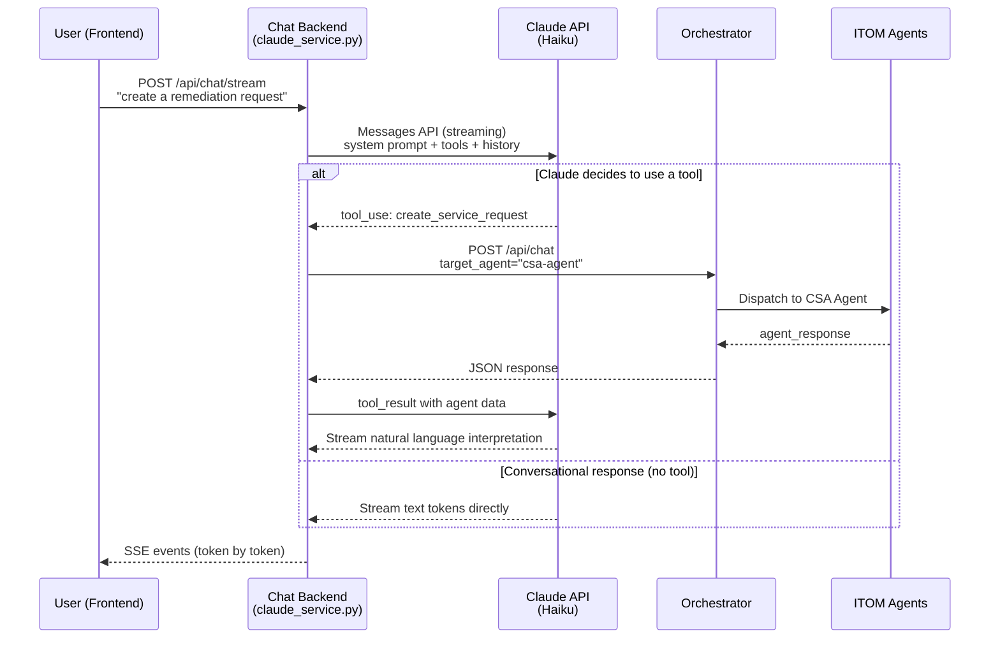

# Claude AI Integration Architecture

## Overview

The Claude AI integration adds a conversational intelligence layer between the chat frontend and the ITOM orchestrator. Instead of relying on keyword matching to route user messages to the correct agent, Claude uses semantic understanding and tool_use to classify intent and call the right agent.

## Architecture Diagram



## Before vs After

### Before: Keyword Router

```
User: "create a remediation request"
  -> router.py: keyword scan
  -> "remediation" matches CSA (priority 9) AND "remediate" in CMDB (priority 10)
  -> Ambiguity detection or wrong agent wins
  -> Clarification dialog or incorrect routing
```

### After: Claude Tool Use

```
User: "create a remediation request"
  -> Claude: semantic understanding -> calls create_service_request tool
  -> Chat backend: POST /api/chat with target_agent="csa-agent"
  -> Orchestrator: explicit targeting (Step 1 of cascade, no keyword matching)
  -> CSA agent executes correctly
```

The keyword router is never consulted when Claude is active. It remains as a fallback when `CHAT_ANTHROPIC_API_KEY` is not set.

## Message Flow Paths

### Path 1: Tool Use (most common)

1. User sends message via SSE endpoint
2. `stream_claude_response()` adds message to conversation history
3. Claude API called with streaming, system prompt, history, and 6 tool definitions
4. Claude emits `tool_use` content block (e.g., `query_cmdb`)
5. `_call_orchestrator_tool()` sends `POST /api/chat` with explicit `target_agent`
6. Orchestrator dispatches to the correct agent (bypasses keyword routing)
7. Tool result fed back to Claude as `tool_result` message
8. Claude streams natural language interpretation of agent data
9. SSE `token` events sent to frontend in real-time

### Path 2: Conversational (no tool call)

1. User sends a follow-up like "what did you find?" or "tell me more"
2. Claude has conversation history and responds directly
3. No orchestrator call needed
4. SSE tokens streamed to frontend

### Path 3: Fallback (no API key)

1. `CHAT_ANTHROPIC_API_KEY` is empty
2. `stream_claude_response()` delegates to `stream_chat_response()` (legacy)
3. Legacy keyword router handles message routing
4. Behavior is identical to pre-Claude integration

### Path 4: Error Fallback

1. Claude API returns `RateLimitError` or `APIError`
2. `stream_claude_response()` logs warning and falls back to legacy streaming
3. `AuthenticationError` returns SSE error event (invalid API key)

## Configuration

| Variable | Default | Description |
|----------|---------|-------------|
| `CHAT_ANTHROPIC_API_KEY` | `""` (disabled) | Anthropic API key. When empty, legacy routing is used. |
| `CHAT_CLAUDE_MODEL` | `claude-haiku-4-5-20251001` | Claude model ID |
| `CHAT_CLAUDE_MAX_TOKENS` | `4096` | Maximum tokens per response |
| `CHAT_CLAUDE_TEMPERATURE` | `0.3` | Temperature (lower = more deterministic) |

## Tool Definitions

| Tool Name | Target Agent | Use Case |
|-----------|-------------|----------|
| `query_cmdb` | `cmdb-agent` | CI search, health metrics, stale/duplicate CIs |
| `create_service_request` | `csa-agent` | Service/remediation requests, catalog items |
| `run_discovery` | `discovery` | Network scans, IP range discovery |
| `manage_assets` | `asset` | Hardware/software inventory, licenses |
| `run_audit` | `auditor` | Compliance checks, drift detection |
| `generate_documentation` | `documentator` | Runbooks, KB articles |

Each tool accepts a `query` string parameter plus an optional `tool_hint` string for explicit MCP tool targeting (bypasses keyword matching). When Claude can determine the exact operation, it sets `tool_hint` to the MCP tool name (e.g., `find_stale_configuration_items`, `create_remediation_request`). The `create_service_request` tool also accepts structured `tool_args` for remediation-specific fields (`remediation_type`, `remediation_mode`, `affected_cis`, `risk_level`).

## Remediation Approval Workflow

Remediation requests create a REQ → RITM → N SCTASKs chain in ServiceNow. The response includes two convenience URLs for the user:

| Field | Purpose |
|-------|---------|
| `ritm_url` | Direct link to the RITM record form in ServiceNow |
| `approval_url` | Direct link to the approval action form for the RITM |

**Approval is at RITM level** — one approval gates all per-CI SCTASKs in the batch.

```
Chat: "Create remediation for 12 stale CIs"
  → Claude calls create_service_request(tool_hint="create_remediation_request", ...)
  → CSA agent creates REQ/RITM/SCTASKs
  → Response includes ritm_url + approval_url
  → User clicks approval_url → ServiceNow approval form
  → Approver approves → Request Agent polling detects → pipeline continues
```

The agent is **read-only for approval decisions** — it monitors state via `check_approval_status` (which also returns `ritm_url` and `approval_url`) but never writes approval decisions programmatically.

## Conversation History

- **Storage**: In-memory `OrderedDict` keyed by `conversation_id`
- **Per-conversation limit**: 20 messages (oldest trimmed)
- **Total conversations**: 500 max (LRU eviction)
- **Message format**: Claude API format (`role` + `content`)
- **Includes**: User messages, assistant responses, tool_use blocks, tool_result blocks

This enables multi-turn conversations where Claude remembers context:
- "Show me production servers" -> tool call -> response
- "Which ones are unhealthy?" -> Claude uses context, may call tool again
- "Create a remediation request for those" -> Claude routes to CSA with context

## Error Handling

| Error | Behavior |
|-------|----------|
| No API key | Transparent fallback to legacy streaming |
| `AuthenticationError` | SSE error event (`CLAUDE_AUTH_ERROR`) |
| `RateLimitError` | Fallback to legacy streaming (logged warning) |
| `APIError` | Fallback to legacy streaming (logged warning) |
| Orchestrator unreachable | Error returned as tool_result; Claude explains to user |
| Orchestrator timeout | Error returned as tool_result; Claude suggests retry |
| Unknown tool name | Error string returned as tool_result |

## Files Changed

| File | Change |
|------|--------|
| `backend/pyproject.toml` | Added `anthropic>=0.40` dependency |
| `backend/app/config.py` | Added 4 Claude settings fields |
| `backend/.env.example` | Added Claude env var documentation |
| `backend/app/services/claude_service.py` | **New** — core Claude service |
| `backend/app/routers/chat_stream.py` | Swapped to `stream_claude_response` |
| `backend/app/main.py` | Added Claude mode startup log |
| `frontend/src/components/chat/ChatBubble.tsx` | Added `claude` agent mappings |
| `backend/tests/conftest.py` | Added `CHAT_ANTHROPIC_API_KEY=""` default |
| `backend/tests/test_claude_service.py` | **New** — unit tests |
| `backend/tests/integration/test_claude_integration.py` | **New** — integration tests |
